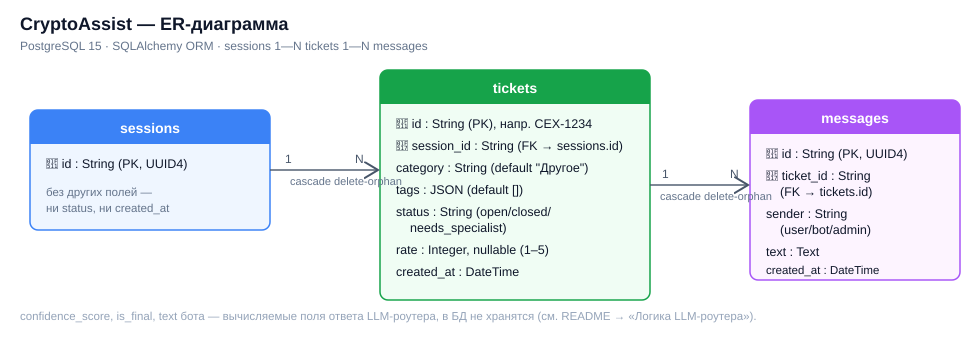
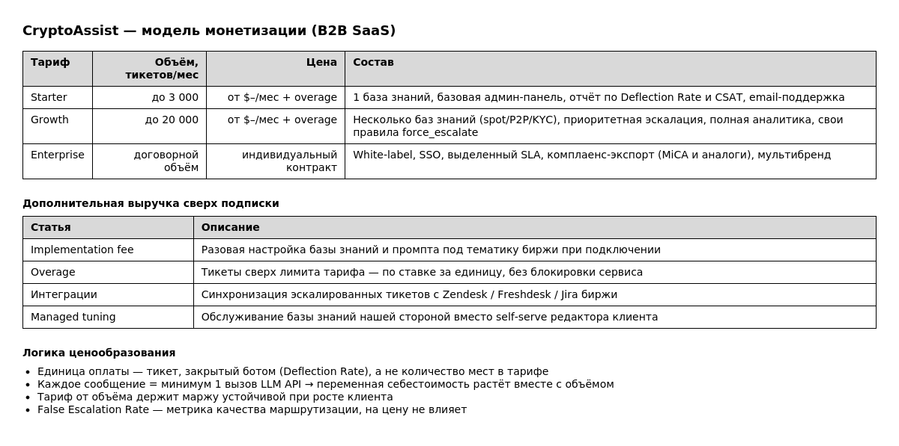
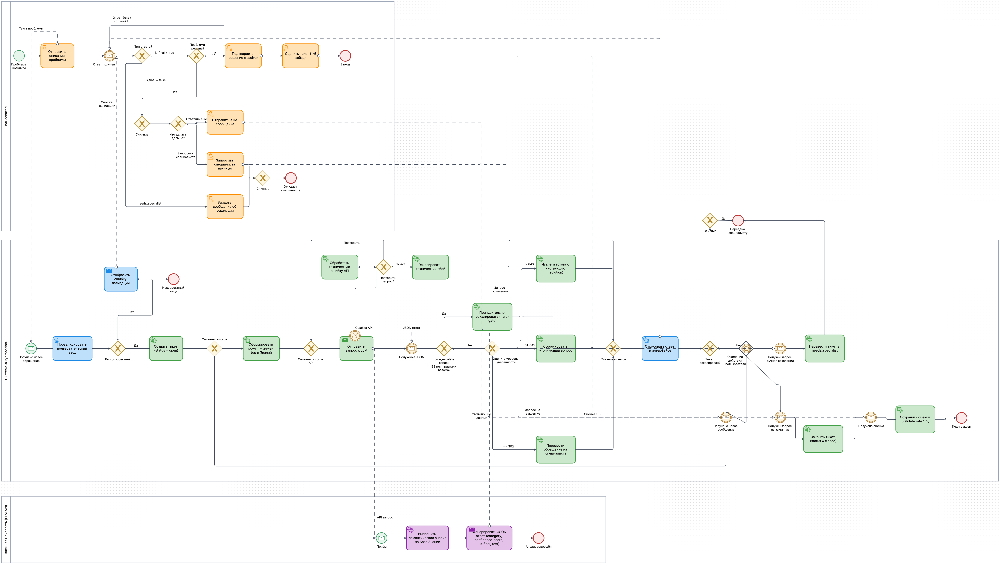

# CryptoAssist

ИИ-ассистент первой линии техподдержки для криптовалютной биржи.
Пользователь описывает проблему → бот классифицирует обращение и уточняет
детали → выдаёт готовое решение **или** эскалирует на живого специалиста,
если решения нет в базе знаний или ситуация чувствительная (взлом аккаунта,
вывод средств и т.п.).

> Хакатон-кейс **«Кейс 2. Помоги мне»** — виртуальная техническая поддержка.
> MVP изначально делался как IT Helpdesk политеха («ПолитехАссист») и был
> адаптирован под техподдержку криптобиржи заменой базы знаний, категорий и
> системного промпта — архитектура и стек при этом не менялись.

### Почему сменили домен

Классический IT Helpdesk (Wi-Fi, VPN, доступы, оборудование) — самая
очевидная и ожидаемая интерпретация кейса «Помоги мне»: её делает
большинство команд, и на защите такое решение легко теряется среди
похожих. Мы сознательно заменили идею на техподдержку криптовалютной
биржи ради креативности и нестандартной подачи:

- показали, что архитектура (FastAPI + Context Stuffing + confidence-
  based роутинг) **предметно-независима** — переезд на новый домен
  занял замену `knowledge.json`, категорий и системного промпта;
- получили более выразительный и рискованный кейс с реальными
  high-stakes сценариями (взлом аккаунта, задержка вывода средств),
  где хорошо видна ценность строгой маршрутизации и принудительной
  эскалации — а не просто «сброс пароля от Wi-Fi»;
- усилили бизнес-историю: B2B SaaS для крипто-бирж — понятный,
  объёмный рынок с наглядной unit-экономикой (цена за тикет).

## Документация проекта

Полное PRD/SRS — [`docs/CryptoAssist_PRD.docx`](docs/CryptoAssist_PRD.docx):
бизнес-требования, UI/UX и навигация, ER-модель БД, полная спецификация
REST API, системный промпт и логика LLM-классификации, edge cases,
нефункциональные требования, метрики успеха и состав команды/ролей.

---

## Содержание

- [Документация проекта](#документация-проекта)
- [Демо-сценарий](#демо-сценарий)
- [Архитектура](#архитектура)
- [Технологический стек](#технологический-стек)
- [Структура репозитория](#структура-репозитория)
- [Быстрый старт](#быстрый-старт)
- [Переменные окружения](#переменные-окружения)
- [Схема базы данных (ERD)](#схема-базы-данных-erd)
- [REST API](#rest-api)
- [Логика LLM-роутера](#логика-llm-роутера)
- [База знаний](#база-знаний)
- [Метрики успеха](#метрики-успеха)
- [Монетизация](#монетизация)
- [BPMN-процесс](#bpmn-процесс)
- [Известные ограничения / открытые вопросы](#известные-ограничения--открытые-вопросы)

---

## Демо-сценарий

1. Пользователь заходит на сайт — фронтенд создаёт анонимную сессию
   (`POST /sessions`), `session_id` кладётся в `localStorage`. Отдельной
   аутентификации нет.
2. Пользователь пишет первое сообщение → создаётся тикет
   (`POST /sessions/{id}/tickets`) → бэкенд собирает системный промпт с
   полной базой знаний и отправляет в LLM.
3. Модель возвращает строгий JSON: `category`, `confidence_score`,
   `is_final`, `text`.
   - **confidence 85–100** — в базе знаний есть готовое решение, бот
     пересказывает его пользователю.
   - **confidence 31–84** — бот задаёт один уточняющий вопрос
     (`is_final: false`), диалог продолжается.
   - **confidence 0–30** — решения нет, бот сообщает о переводе на
     специалиста, тикет уходит в статус `needs_specialist`.
4. Для чувствительных категорий (например, «Безопасность») действует
   принудительная эскалация на уровне бэкенда — независимо от того, что
   вернула модель (подробнее — [Логика LLM-роутера](#логика-llm-роутера)).
5. Если бот дал решение, пользователь явно подтверждает это кнопкой
   «Проблема решена» (`PATCH /tickets/{id}/resolve`) — тикет закрывается.
   `is_final: true` сам по себе тикет **не закрывает**.
6. После закрытия пользователь оставляет оценку 1–5
   (`PATCH /tickets/{id}/rating`).

## Архитектура

```
┌────────────┐      HTTP/JSON      ┌──────────────┐      OpenAI-совместимый API      ┌─────────────┐
│  Frontend  │ ──────────────────▶ │   Backend    │ ────────────────────────────────▶ │  LLM (внеш.)│
│ React+Vite │ ◀────────────────── │   FastAPI    │ ◀──────────────────────────────── │ deepseek-v4 │
└────────────┘                     └──────┬───────┘                                   └─────────────┘
                                           │ SQLAlchemy ORM
                                           ▼
                                   ┌───────────────┐
                                   │  PostgreSQL   │  (fallback: SQLite для локальной разработки)
                                   └───────────────┘
```

Ключевые архитектурные решения:

- **Без RAG и векторных БД.** Подход — *In-Context Learning / Context
  Stuffing*: вся база знаний целиком инжектится в системный промпт при
  каждом запросе к LLM (`knowledge.json`, компактная структура, одна
  запись на категорию — базу не нужно масштабировать до тысяч записей).
- **Приложение stateless**, без сессий на сервере и без логина —
  идентификация пользователя только через UUID сессии на клиенте.
- **Тикет-центричная модель**, а не «сообщения внутри сессии»: у каждого
  обращения свой `ticket_id`, статус и история сообщений.
- **Двойная/тройная защита чувствительных категорий** — структурная
  (пустой `solution` в базе знаний) + hard-gate на бэкенде +
  keyword-override по тексту пользователя. Подробнее ниже.

## Технологический стек

| Слой | Технологии |
|---|---|
| Frontend | React 19, Vite, Tailwind CSS v4, React Router, Axios, Lucide React |
| Backend | Python, FastAPI, Pydantic |
| БД | PostgreSQL 15 (Docker) / SQLite (dev fallback), SQLAlchemy ORM |
| LLM | OpenAI-совместимый клиент, модель `deepseek-v4-flash-0731`, `response_format=json_object`, `temperature=0` |

## Структура репозитория

```
.
├── main.py                 # FastAPI-приложение, все эндпоинты, системный промпт, вызов LLM
├── models.py                # SQLAlchemy-модели: SessionModel, TicketModel, MessageModel
├── schemas.py                # Pydantic-схемы запросов/ответов
├── database.py                # engine/session/Base, DATABASE_URL из .env
├── knowledge.json                # База знаний (category/tags/issue/solution/force_escalate)
├── requirements.txt                # Python-зависимости backend
├── Dockerfile                        # Сборка образа backend
├── docker-compose.yml                # backend + PostgreSQL одним поднятием
│
├── help-me/                 # Frontend (React 19 + Vite)
│   ├── src/
│   │   ├── api/            # apiClient.js, sessionsApi.js, ticketsApi.js — единый API-слой
│   │   ├── mock/            # Mock API для работы без бэкенда
│   │   ├── components/      # chat/, layout/, common/
│   │   ├── pages/            # HomePage, ChatPage, HistoryPage, TicketsPage, ServicesPage, FaqPage, ...
│   │   └── App.jsx           # роутинг (react-router-dom)
│   └── ...
│
└── docs/
    ├── CryptoAssist_PRD.docx  # Полный PRD/SRS проекта
    ├── erd.svg                # ER-диаграмма базы данных
    ├── bpmn-diagram.png       # Визуализация BPMN-процесса
    └── monetization.png       # Модель монетизации
```

`.env`-файлы backend и frontend не коммитятся в репозиторий (см. `.gitignore`).
Список переменных для каждого сервиса — в разделе «Переменные окружения».

## Быстрый старт

### Backend

**Вариант A — Docker (быстрее всего, поднимает и PostgreSQL):**

```bash
docker compose up --build
```

**Вариант B — локально, без Docker:**

```bash
python -m venv venv && source venv/bin/activate   # Windows: venv\Scripts\activate
pip install -r requirements.txt

# .env в корне проекта — переменные см. в разделе "Переменные окружения"
uvicorn main:app --reload --port 8000
```

Swagger-документация после запуска: `http://localhost:8000/docs`.

Без `DATABASE_URL` бэкенд поднимет локальный SQLite-файл `support.db` —
Postgres для локальной разработки не обязателен вне Docker-варианта.

### Frontend

```bash
cd help-me
npm install
# .env — переменные см. в разделе "Переменные окружения"
npm run dev
```

По умолчанию `VITE_USE_MOCK_API=false` — фронтенд обращается к реальному
бэкенду. Для демонстрации UI без поднятого бэкенда переключите флаг в
`true` — приложение проиграет заготовленный сценарий через Mock API
(`src/mock/`), в точности повторяющий формат реального API.

## Переменные окружения

`.env`-файлы нигде не коммитятся, в репозитории их нет — ниже список
переменных, которые они содержат.

**Backend — `.env` в корне проекта**

| Переменная | Назначение | По умолчанию |
|---|---|---|
| `OPENAI_API_KEY` | Ключ LLM-провайдера | — |
| `OPENAI_BASE_URL` | Base URL OpenAI-совместимого API | `https://api.apinex.bond/v1` |
| `OPENAI_MODEL` | Название модели | `free/deepseek-v4-flash-0731` |
| `DATABASE_URL` | Строка подключения к БД | `sqlite:///./support.db` |

**Frontend — `help-me/.env`**

| Переменная | Назначение |
|---|---|
| `VITE_API_BASE_URL` | Адрес бэкенда, например `http://localhost:8000/api/v1` |
| `VITE_USE_MOCK_API` | `true` — работа на моках без бэкенда, `false` — реальный API |

## Схема базы данных (ERD)



**`sessions`** — только `id` (UUID4). Ни статуса, ни `created_at` нет.
Каскадное удаление тикетов при удалении сессии.

**`tickets`**

| Поле | Тип | Описание |
|---|---|---|
| `id` | String, PK | Например `INC-1234` / `CEX-1234` |
| `session_id` | String, FK → `sessions.id` | |
| `category` | String, default `"Другое"` | |
| `tags` | JSON, default `[]` | Массив тегов маршрутизации |
| `status` | String, default `"open"` | `open` / `closed` / `needs_specialist` |
| `rate` | Integer, nullable | 1–5, заполняется только после `/resolve` |
| `created_at` | DateTime | |

**`messages`**

| Поле | Тип | Описание |
|---|---|---|
| `id` | String, PK | UUID4 |
| `ticket_id` | String, FK → `tickets.id` | |
| `sender` | String | `user` / `bot` / `admin` |
| `text` | Text | |
| `created_at` | DateTime | |

Связь `tickets` → `messages` один-ко-многим, `cascade="all, delete-orphan"`.

## REST API

Базовый URL: `/api/v1`.

| Метод | Endpoint | Назначение |
|---|---|---|
| `POST` | `/sessions` | Создание анонимной сессии |
| `GET` | `/sessions/{session_id}/tickets` | Список тикетов сессии |
| `POST` | `/sessions/{session_id}/tickets` | **Core.** Первое сообщение → новый тикет + ответ бота |
| `POST` | `/tickets/{ticket_id}/messages` | Следующее сообщение в открытом тикете (400, если тикет не `open`) |
| `GET` | `/tickets/{ticket_id}/messages` | История сообщений тикета |
| `PATCH` | `/tickets/{ticket_id}/resolve` | Пользователь подтверждает решение → `status=closed` |
| `PATCH` | `/tickets/{ticket_id}/close` | Принудительное закрытие специалистом |
| `PATCH` | `/tickets/{ticket_id}/rating` | Оценка 1–5, доступна только после закрытия |
| `GET` | `/tickets?session_id=...` | Тикеты пользователя («Мои заявки») |
| `GET` | `/tickets?status=needs_specialist` | Очередь для админ-панели специалиста |

Пример ответа бота (`TicketBotResponse`):

```json
{
  "ticket_id": "INC-4821",
  "message_id": "b3c1...",
  "sender": "bot",
  "text": "Похоже, дело в двухфакторной аутентификации. Проверьте...",
  "category": "Безопасность",
  "tags": ["2fa", "login"],
  "confidence_score": 92,
  "is_final": true,
  "status": "open"
}
```

## Логика LLM-роутера

Модель вызывается с `temperature=0`, `response_format={"type": "json_object"}`
и системным промптом, куда целиком встроена база знаний. Модель обязана
вернуть строгий JSON с `category`, `confidence_score`, `text`, `is_final`.

| `confidence_score` | Действие |
|---|---|
| 85–100 | Найдено совпадение — бот пересказывает `solution` из базы знаний, `is_final: true` |
| 31–84 | Неоднозначно — один короткий уточняющий вопрос, `is_final: false` |
| 0–30 | Решения нет — сообщение о переводе на специалиста, `status=needs_specialist` принудительно |

**Тройная защита чувствительных категорий** (например, «Безопасность» /
компрометация аккаунта):

1. **Структурная** — у соответствующей записи базы знаний поле `solution`
   пустое и `force_escalate: true`: модели физически нечего предложить.
2. **Backend hard-gate** — если найденная запись имеет `force_escalate: true`,
   бэкенд не отдаёт решение и принудительно переводит тикет в
   `needs_specialist`, независимо от ответа LLM.
3. **Keyword-override** — явные признаки компрометации аккаунта в тексте
   пользователя триггерят эскалацию даже без совпадения по базе знаний.

Дополнительные ограничения промпта: запрет на инвестиционные советы, запрет
утверждать, что бот «проверил» баланс/транзакцию конкретного пользователя
(доступа к данным аккаунта у бота нет). При сбое LLM API бэкенд возвращает
безопасный fallback-ответ и переводит тикет на специалиста, не роняя запрос.

## База знаний

`knowledge.json` — не классические пары «вопрос-ответ», а компактная
структура, одна запись на категорию:

```json
{
  "category": "Безопасность",
  "tags": ["hack", "unauthorized_login", "2fa"],
  "issue": "Признаки компрометации аккаунта",
  "solution": "",
  "force_escalate": true
}
```

Категории: **KYC, Ввод средств, Вывод средств, Торговля/Ордера,
Безопасность, Комиссии, Другое**. Записи без `solution` существуют не
для генерации ответа, а для классификации/маршрутизации через `tags` —
чтобы, например, запрос о краже средств не «утёк» в соседнюю категорию
«Задержка вывода».

## Метрики успеха

- **Deflection Rate** — доля обращений, закрытых ботом без эскалации.
  Целевой показатель: **20–30%** (ниже, чем в исходном IT Helpdesk,
  из-за обязательной эскалации чувствительных категорий).
- **CSAT** — оценка 1–5 через `rate`.
- **False Escalation Rate** — доля обращений категорий «Безопасность» /
  «Вывод средств», которые бот попытался закрыть сам вместо эскалации.
  Целевой показатель: **0%**.

## Монетизация

B2B SaaS-подписка для криптовалютных бирж, цена привязана к объёму
тикетов (а не к числу мест специалистов), потому что каждое сообщение
пользователя — это минимум один вызов LLM API, то есть прямая переменная
себестоимость.

| Тариф | Объём, тикетов/мес | Состав |
|---|---|---|
| Starter | до 3 000 | 1 база знаний, базовая админ-панель, отчёт Deflection Rate/CSAT, email-поддержка |
| Growth | до 20 000 | Несколько баз знаний (spot/P2P/KYC), приоритетная эскалация, полная аналитика, свои правила `force_escalate` |
| Enterprise | договорной объём | White-label, SSO, выделенный SLA, комплаенс-экспорт (MiCA и аналоги), мультибренд |

Доп. выручка: implementation fee, overage сверх лимита тарифа, интеграции
с Zendesk/Freshdesk/Jira, managed tuning базы знаний силами команды.



*Финальные цифры цен и unit-экономика LLM-вызова на тикет — в проработке
(см. открытые вопросы ниже).*

## BPMN-процесс

Три пула: **Пользователь / Система CryptoAssist / Внешняя Нейросеть (LLM
API)**. Диаграмма фиксирует создание тикета первым сообщением, hard-gate
`force_escalate` до расчёта `confidence_score`, явный `resolve` вместо
автозакрытия ботом, ручную эскалацию кнопкой параллельно с автоматической
и retry-логику при сбое LLM API.



## Известные ограничения / открытые вопросы

- Валидация `rate` (1–5) сейчас реализована на уровне Pydantic-схемы
  (`Field(ge=1, le=5)`); constraint на уровне БД не заведён.
- Отдельной витрины «История обращений» с превью последнего сообщения
  нет — таблица `sessions` не хранит ничего, кроме `id`. Текущий список
  тикетов сессии (`GET /sessions/{id}/tickets`) используется и как «Мои
  заявки», и как история.
- Точные цифры цен по тарифам и unit-экономика LLM-вызова на тикет не
  посчитаны — есть риск отрицательной маржи на тарифе Starter при частых
  уточняющих диалогах.
- Эндпоинт ручной эскалации (`POST /tickets/{id}/escalate`, кнопка
  «Связаться с поддержкой») описан в процессе и PRD; проверьте наличие
  реализации в актуальной версии `main.py` перед демо.
